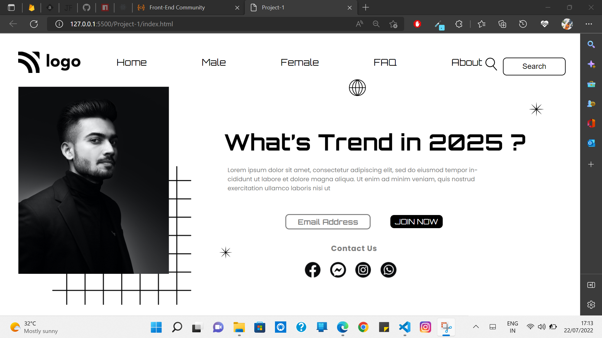

# Project-1

[Live link](https://vinod-kumar-project-1.netlify.app/)

-   I learned this project
    -   To use Z-index and Navbar and Icons and positions

---

## Duration of complete this project

-   Approx 6 hour taken to complete this first project and I am working as fulltime employee in non OT and I am working between night 7:30 to 11:00 PM.

## **The website same as below image**

